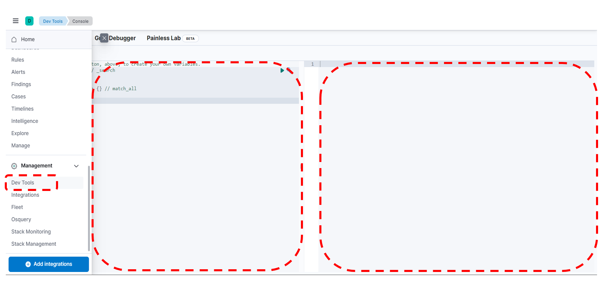

# ElasticSearch Setup 
최초 작성일 : 2023-12-27  
마지막 수정일 : 2024-01-09
  
## 0. Overview
Elasticsearch는 NosSQL 데이터를 저장하고, 조회(검색)할 수 있는 아파치 재단의 루씬(Lucence)을 기반으로 개발된 오픈 소스 검색 엔진이다. 관계형 데이터 베이스와 비교하였을 때, 사용하는 용어와 구조가 다르기 때문에 대표적인 개념을 잠시 정리한다. Elasticsearch 내 다양한 object와 관계형 데이터 베이스(RDBMS)에서의 개념은 다음과 같이 대응된다.

|ElasticSearch|RDBMS|
|---|---|
|인덱스(Index)|데이터베이스(DB)|
|샤드|파티션|
|타입(Type)|테이블|
|문서|행|
|필드|열|
|매핑|스키마|
|Query DSL|SQL|

## Table of Contents
1. [Step up elasticsearch and kibana](#1.-Step-up-elasticsearch-and-kibana)
2. [Basic Operation of Elasticsearch](#2.-Basic-Operation-of-ElasticSearch)

## 1. Step up Elasticsearch and Kibana
ElasticSearch와 Kibana는 Linux, MacOS에서 모두 설치 가능하며, 이 포스팅에서는 Windows 환경을 기준으로 설치 방법에 대해서 기록한다. ElasticSearch를 실행하기 위해서 ElasticSearch와 함께 Kibana를 설치해야 한다. Kibana는 ElasticSearch를 사용할 때, 대시보드를 사용할 수 있도록 GUI를 제공하는 소프트웨어다. 각 소프트웨어의 설치 파일은 아래에서 다운로드 할 수 있다.

```console
https://www.elastic.co/kr/downloads/elasticsearch
```
```console
https://www.elastic.co/kr/downloads/kibana
```

다운로드 이후, 작업 디렉토리에서 압축 파일을 푼다. 예를 들어, C드라이브 아래 작업 디렉토리(ELK, Elasticsearch, Logstash, Kibana의 줄임말)를 생성하고, zip 파일을 옮긴 후, 압축 파일을 푼다. 참고로, 개발 및 환경을 세팅할 때, 경로에는 "한글"과 version을 나타내는 "x.x.x"과 같은 폴더/파일 이름은 생략하는 것을 강력히 권장한다. 필자는 elasticsearch와 kibana가 설치된 폴더의 경로를 아래와 같도록, 폴더 명을 각각 'C:\ELK\elasticsearch'와 'C:\ELK\kibana'로 변경하였다.

먼저, ElasticSearch를 실행하기 위해 yml 파일을 찾아 세팅한다. 'C:\ELK\elasticsearch\config' 폴더 내 'elasticsearch.yml'를 열어서 아래와 같이 실행 정보를 입력한다. 
```yaml
#config/elasticsearch.yml
cluster.name: cluster-test
node.name: cluster-test-node01

path:
  data: C:\ELK\elasticsearch\data
  logs: C:\ELK\elasticsearch\logs  

network.host: 127.0.0.1

discovery.type: "single-node"
xpack.security.enabled: false
```
또, 'C:\ITStudy\ELK\elasticsearch\config\jvm.options 파일에 접속해서, -Xms5g/-Xmx5g의 부분의 주석을 해제하고, -Xms1g/-Xmx1g로 변경한다. 
```
## -Xms5g
## -Xmx5g
```

```
-Xms1g
-Xmx1g
```
해당 수정 부분은 ElasticSearch 사용할 때, 할당하는 메모리에 대한 세팅으로, 메모리에 대한 여유가 있는 유저는 -Xms5g/-Xmx5g 그대로 사용해도 무방하다.

다음으로,  Kibana를 실행하기 위해 yml 파일을 찾아 세팅한다. 'C:\ITStudy\ELK\kibana\config\kibana.yml' 파일에 접속하여, 맨 아래 아래와 같은 세팅값을 추가한다.
```yaml
#config/kibana.yml
server.port: 5601
server.host: localhost
server.publicBaseUrl: "http://localhost:5601"
elasticsearch.hosts: ["http://localhost:9200"]
```
Kibana 웹 인터페이스를 호스팅할 포트로 5601을 지정하고, Kibana 서버의 호스트 주소를 로컬('localhost')로 지정한다. 외부에 노출되는 경우는 기본 URL로 'http://localhost:5601' 를 지정하며, Kibana가 연결할 ElasticSarch 클러스트의 호스트를 'http://localhost:9200' 로 지정하는 내용이다.

구성에 대한 값 변경이 완료되면, 설치된 elasticsearch와 kibana는 아래 batch파일을 터미널을 통해 실행한다.
```console
c:\ELK\elasticsearch\bin\elasticsearch.bat
```
batch 파일이 정상적으로 실행 후, 'http://localhost:9200' 에 접속하면, 실행 정보를 확인할 수 있다.
``` json
{
  "name" : "cluster-test-node01",
  "cluster_name" : "cluster-test",
  "cluster_uuid" : "3IDHI47jTVOjxUskQSvCrw",
  "version" : {
    "number" : "8.11.3",
    "build_flavor" : "default",
    "build_type" : "zip",
    "build_hash" : "64cf052f3b56b1fd4449f5454cb88aca7e739d9a",
    "build_date" : "2023-12-08T11:33:53.634979452Z",
    "build_snapshot" : false,
    "lucene_version" : "9.8.0",
    "minimum_wire_compatibility_version" : "7.17.0",
    "minimum_index_compatibility_version" : "7.0.0"
  },
  "tagline" : "You Know, for Search"
}
```

ElasticSearch가 실행 된 후, Kibana의 batch 파일을 아래와 같이 실행하면, 설치 및 실행이 완료 된다.
```console
c:\ELK\kibana\bin\kibana.bat
```

## 2. Basic Operation of Elasticsearch

kibana에서 제공하는 UI를 사용하기 위해서 'http://localhost:5601'에 접속한다. 왼쪽 'Dev Tools'를 누르면, 아래와 같은 화면이 나타내는데, 요청 쿼리를 입력하는 왼쪽 부분과 요청 쿼리에 응답하여, 결과값을 보여주는 오른쪽 부분으로 구성되어 있다. 아래 설명에선 편의상, 각각을 입력창과 출력창으로 부르겠다.



ElasticSearch에서 하나의 인덱스에 하나의 타입만 구성할 수 있다. 그리고 HTTP를 통해 JSON 형식의 Restful API를 사용한다. 이 때, Restful API는 HTTP 헤더와 URL만 사용하여 다양한 형태의 요청을 할 수 있는 HTTP 프로토콜을 최대한 활용하도록 고안된 아키텍쳐를 의미한다. 사용되는 쿼리(Query DSL)은 다음 표와 같다.
|요청 쿼리|기능|
|---|---|
|GET|데이터 조회|
|PUT, PATCH(일부 수정)|데이터 생성|
|POST|인덱스 업데이트, 데이터 조회|
|DELETE|인덱스 데이터 삭제|
|HEAD|인덱스의 정보 확인|


### 1. 문서 색인
먼저, 테이블 생성 및 데이터 입력에 해당하는 문서 색에 대한 쿼리를 알아보자 
```python
PUT [인덱스 이름]/_doc/[_id값]
{
  [문서 내용]
}
```
의 형식으로 문서 색인을 할 수 있다. 예를 들어, 인덱스 이름이 'my_index', id = 1인 문서를 생성하기 위해 입력창에 입력해야하는 쿼리는 아래와 같다.
```python
PUT my_index/_doc/1
{
	"title": "hello world",
	"view" : 1234,
	"public" : true,
	"created" : "2024-01-09T14:05:01.234Z"
}
```
그러면, 출력창을 통해 성공적으로 문서가 생성되었음을 확인할 수 있다.
```python
{
  "_index": "my_index",
  "_id": "1",
  "_version": 1,
  "result": "created",
  "_shards": {
    "total": 2,
    "successful": 1,
    "failed": 0
  },
  "_seq_no": 0,
  "_primary_term": 1
}
```
### 2. 문서 조회
RDBMS 내 "SELECT" 쿼리에 해당하는 조회 쿼리 아래와 같이 구성된다.
```python
GET [인덱스 이름]/_doc/[_id값]
```
생성하였던 문서를 조회하기 위해서, 인덱스 이름과 id를 입력창에 입력한다.
```python
GET my_index/_doc/1
```
그러면, 출력창에 다음과 같은 결과값이 출력된다.
```python
{
  "_index": "my_index",
  "_id": "1",
  "_version": 1,
  "_seq_no": 0,
  "_primary_term": 1,
  "found": true,
  "_source": {
    "title": "hello world",
    "view": 1234,
    "public": true,
    "created": "2024-01-09T14:05:01.234Z"
  }
}
```
### 3. 문서 업데이트
문서 업데이트는 수정, 삭제, 추가된 내용을 문서에 반영하는 동작을 의미한다.
``` python
POST [인덱스 이름]/_update/[_id값]
{
	"doc": {
		[문서 내용]
	}
}
```
만약, 문서 내 'title'을 'hello world'에서 'hello elasticsearch'로 변경한다면, 아래와 같이 입력하여 실행한다. 이 때, 인덱스와 id가 올바르게 입력되었는지 항상 유의한다.
``` python
POST my_index/_update/1
{
	"doc": {
		"title": "hello elaticsearch"
	}
}
```
출력부에는 정상적으로 문서 업데이트가 된 내용이 출력된다. 특히, 문서를 생성(create)했었을 때와 달리, 문서의 버전('_version')이 '2'가 되었음을 확인할 수 있다.
```python
{
  "_index": "my_index",
  "_id": "1",
  "_version": 2,
  "result": "noop",
  "_shards": {
    "total": 2,
    "successful": 1,
    "failed": 0
  },
  "_seq_no": 2,
  "_primary_term": 1
}
```


## 4. log 수집

C:\ITStudy\ELK\server1\script1.py
```python
from flask import Flask

app = Flask(__name__)

@app.route('/subpage1')
def deposit():
    return 'subpage1'

@app.route('/subpage2')
def withdraw():
    return 'subpage2'

if __name__ == '__main__':
    app.run("0.0.0.0", port=5001, debug=True)
```

C:\ELK\server1\filebeat\filebeat.yml

```yml

filebeat:
  inputs:
    - type: log
      enabled: true
      paths:
        - C:/ELK/server1/script1.log
output.logstash:
  hosts: ["localhost:5044"]
```


C:\ELK\logstash\config\logstash-from-server1.conf

```conf
input {
    beats {
        port => 5044
    }
}

filter {
    grok {
        match => { "message" => '%{IP:client_ip} - - \[%{GREEDYDATA:timestamp}\] "%{WORD:http_method} %{URIPATH:request_path} HTTP/%{NUMBER:http_version}" %{NUMBER:response_code} -'
}
    }

    mutate {
        remove_field => ["host", "@version", "message", "agent", "log"]
    }
}

output {
  elasticsearch {
    hosts => "http://127.0.0.1:9200"
    # index => "logs-server1-%{+YYYY.MM.dd}"
	index => "logs-server"
    data_stream => false
    action => "create"
  }
  stdout {}
}
```

