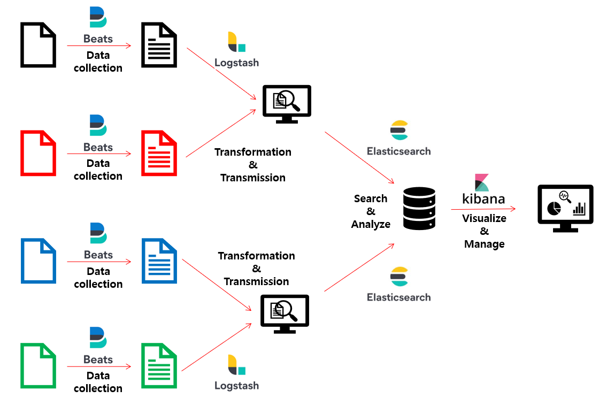
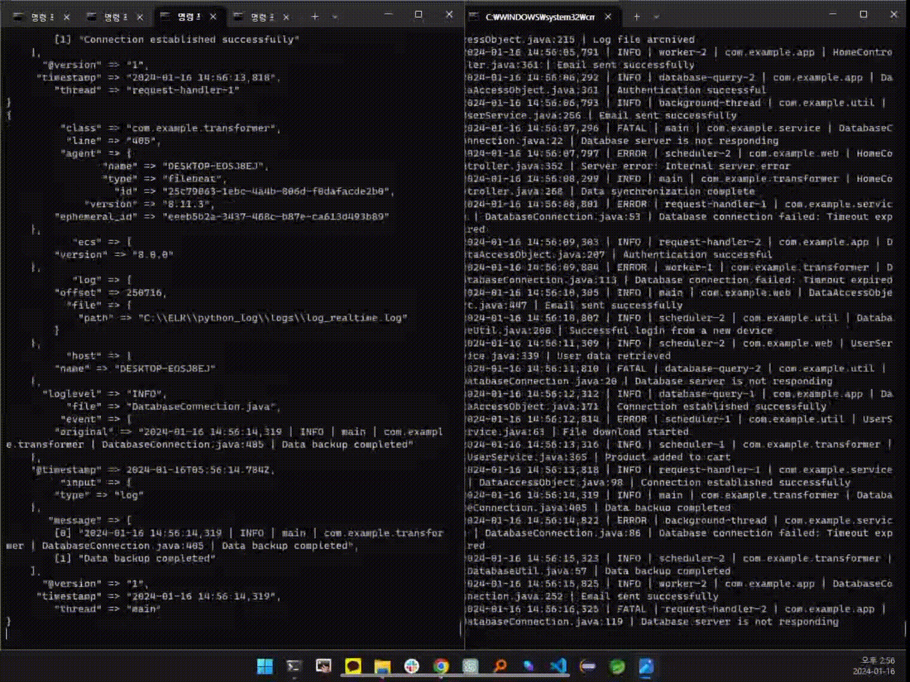
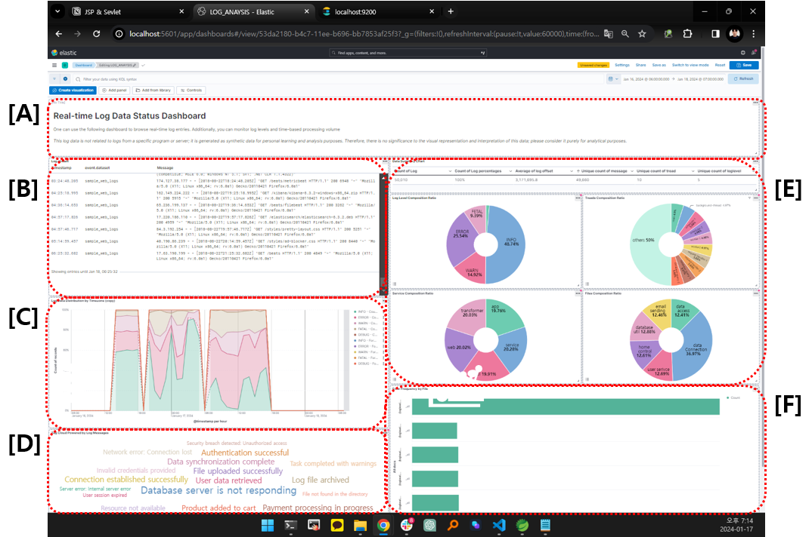
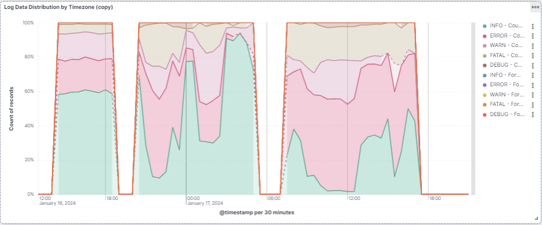
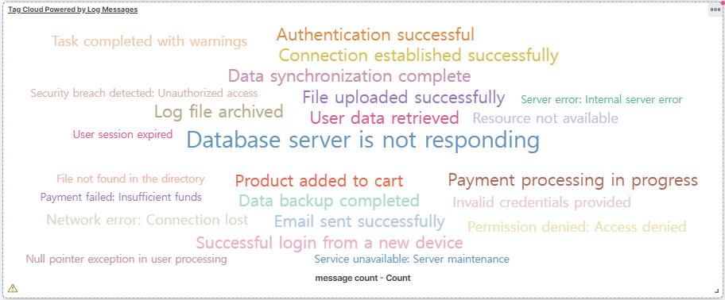
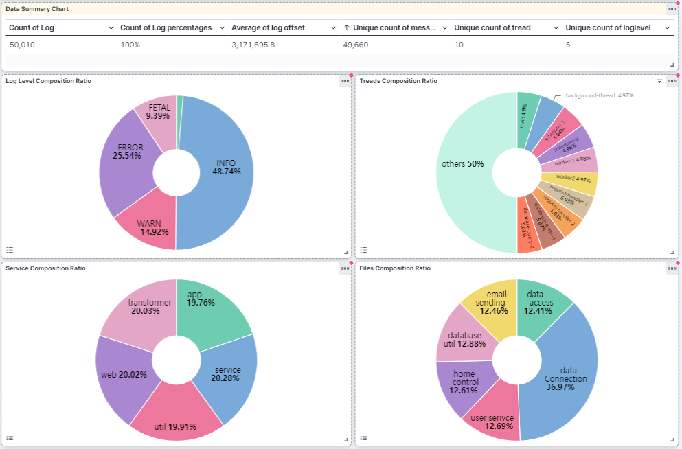
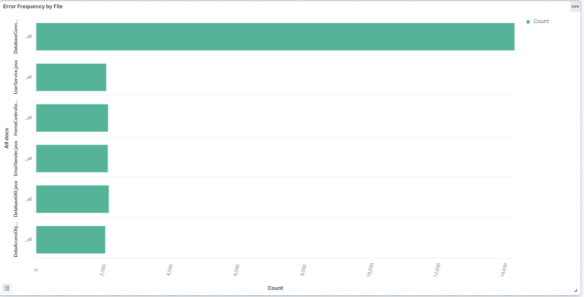

# Elastic Stack
최초 작성일 : 2023-12-27  
마지막 수정일 : 2024-01-16
  
## 0. Overview
ELK Stack 또는 Elastic Stack은  Elasticsearch, Logstash, Kibana 및 Beats으로 알려진 일련의 오픈 소스 도구와 기술 스택 의미하며, 이들은 대규모 정형/비정형 데이터를 입수, 변환, 저장, 모니터링, 분석, 시각화 하는데 필수적인 도구로 자리잡고 있다. Elastic Stack을 이용하면 다양한 데이터를 분석하고 시각화를 할 수 있지만, 그 중 활용도가 가장 높은 분야는 로그 및 이벤트 데이터를 처리하고 시각화하는 부분이다. 본 프로젝트에서는 Python을 사용하여 가상 로그 데이터를 생성하고, 생성된 로그 데이터를 실시간으로 패턴 분석하여 데이터베이스에 저장하며, 이 데이터를 시각화하는 대시보드를 개발하였다. 아래는 대시보드를 통해 실시간으로 수집되는 로그 데이터를 시각화하는 화면으로, 각 구성요소에 대한 역할은 아래 kibana에 대한 설명에 포함 되어 있다.


본 레포지토리에서는 로그 데이터 분석 작업에 부가적으로, Elastic Stack을 설치하고, 간단히 조작하는 방법(KQL 쿼리, Index 조회)에 대해서 설명한다.

## Table of Contents

1. [Building a Pipeline Using Elastic Stack](#1.-Building-a-Pipeline-Using-Elastic-Stack)
2. [Execute Beats](#2.-Execute-Beats)
3. [Execute Logstash](#3.-Execute-Logstash)
4. [Step up Elasticsearch and kibana](#4.-Step-up-Elasticsearch-and-kibana)
5. [Dashboard for Kibana](#5.-Dashboard-for-Kibana)
6. [(Appendix)Basic Operation of Elasticsearch](#6.-(Appendix)-Basic-Operation-of-Elasticsearch)
7. [(Appendix)Query DSL of Elasticsearch](#7.-(Appendix)-Query-DSL-of-Elasticsearch)


## 1. Building a Pipeline Using Elastic Stack


ELK Stack 또는 Elastic Stack은 Elasticsearch, Logstash, 그리고 Kibana를 함께 연동하여 데이터 파이프라인을 구축하고, 데이터 수집, 변환, 저장, 시각화, 그리고 분석을 수행하는 오픈 소스 데이터 처리하는 솔루션을 의미한다. 각 구성원은 다음과 같은 역할을 수행한다.
|Name|Description|
|--|--|
|Beats|로그 및 이벤트 데이터를 수집하고 전송하기 위한 경량 데이터 수집 에이전트이며,  주로 서버 및 애플리케이션에서 생성되는 로그 파일 및 이벤트 데이터를 실시간으로 수집하여 Elastic Stack 구성 요소로 전송하는 역할을 수행한다.|
|Logstash|Logstash는 데이터 수집, 변환, 가공, 필터링 및 전송을 위한 데이터 처리 엔진이다. 다양한 데이터 소스로부터 데이터를 수집하고, 필요한 데이터 가공 및 전송을 수행한다.Logstash는 다중 입력 및 출력을 지원하여 여러 데이터 소스 및 목적지 간의 통합을 용이하게 한다.|
|Elasticsearch|실시간 검색 및 분석 엔진으로, 구조화된 및 비구조화된 데이터를 저장하고 검색하기 위한 오픈 소스 분산 데이터베이스이다.Elasticsearch는 클러스터링을 지원하므로 대규모 데이터 처리가 가능하다.|
|Kibana| Kibana는 Elasticsearch 데이터를 그래프, 차트, 지도 등 다양한 형태의 시각화하는 대시보드를 지원한다. 대시보드를 활용하여, 로그 및 이벤트 데이터를 실시간으로 수집, 가공, 저장, 시각화하고, 대규모 데이터 분석 및 모니터링을 수행한다.|

요약하면, Elastic Stack을 활용하면, log파일과 같은 다양한 데이터를 읽어, 전처리를 수행하고, Elasticsearch라는 DataBase에 저장하고, 저장된 데이터를 Kibana가 시각화하여, 손쉽게 시각화할 수 있다. 각 구성 요소의 역할을 시각화하면 아래 그림과 같다.



본 분석을 위해 실시간으로 가상의 로그 데이터를 생성하는 python 함수를 작성하여 활용하였고, 해당 python 소스는 ELK 내 있는 python 함수이다. 아래에서 데이터 흐름 순서에 대응하여, Beats, logstash, Elasticsearch, kibana에 대해 차례대로 실행하는 방법에 대해서 설명하고 있지만, 데이터가 전송 후, 수신이 되지 않는 문제를 고려하여, Elasticsearch, logstash, Beats 순으로 실행할 것을 권장한다.

### 2. Execute Beats  
먼저, Beats을 실행하기 위해서는 읽고자 하는 파일(csv, txt, log 등)의 경로를 입력한 Beats.yml을 Beats.exe가 실행하는 구조이다. 필자는 yml, exe 포함한  Beats 폴더를 log 데이터가 있는 폴더에 위치해 두었고, yml 파일을 다음과 같이 구성하였다.
``` yaml
Beats:
  inputs:
    - type: log
      enabled: true
      paths:
        - C:/ELK/python_log/logs/log_realtime.log
output.logstash:
  hosts: ["localhost:5044"]
```
inputs 내 paths에 읽고자 하는 로그 파일의 위치를 지정하고, 데이터를 Logstash로 전송하기 위해 Logstash 서버의 호스트와 포트를 입력했다. 대규모 데이터 처리 시, 관련된 데이터 저장소마다 Beats을 사용하여 동일한 경로에서 데이터를 수집하도록 경로를 지정하는 것을 권장하지만, yaml 파일을 아래와 같이 구성하여 다른 경로의 파일도 읽어들이도록 구성할 수 있고, logstash 서버로 전송하는 것이 아닌 Elasticsearch 서버로 전송할 수 있다.(물론 경로 설정은 아래와 같이 설정할 수 있지만, grok 패턴 분석 및 색인 과정은 별도로 수행해야 한다.)

``` yaml
Beats.inputs:
  - type: log
    enabled: true
    paths:
      - /path/to/logs/*.csv
      - /path/to/logs/*.txt
      - /path/to/logs/*.log

utput.Elasticsearch:
  hosts: ["Elasticsearch-server:9200"]
```

마지막으로 Beats을 실행하는 방법은 명령 프롬프트에서 Beats이 있는 폴더로 이동을 하고, yml파일을 설정 파일로 지정하여 실행파일(.exe)을 실행한다.
```
cd C:\ELK\python_log\Beats

.\Beats.exe -c .\Beats.yml
```

## 3. Execute Logstash  
Logstash는 설정 파일(.conf)을 통해 batch 파일로 실행되기 때문에, 설정 파일을 적절하게 세팅해야 한다.

```conf
input {
    beats {
        port => 5044
        include_codec_tag => false
    }
}

filter {
    grok {
        match => {"message" => "%{TIMESTAMP_ISO8601:timestamp} \| %{LOGLEVEL:loglevel} \| %{DATA:thread} \| %{DATA:class} \| %{DATA:file}:%{NUMBER:line} \| %{GREEDYDATA:message}"}
        }
}

output {
  Elasticsearch {
    hosts => "http://127.0.0.1:9200"
    index => "analysis_log_20240116"
    data_stream => false
    action => "create"
    # log_message => "[INFO][%{host}] create index, %{index}"
  }
  stdout {}
}
```
입력부(input)에는 beat으로부터 port 5044에 데이터 입력되는 것을 작성하였고, filter에는 로그 파일의 데이터를 어떻게 구분하는지에 대한 정보를 작성한다. 이 때, log 데이터를 분석하기 위해 grok패턴이라는 정규식을 사용한다. log 데이터는 일정한 정규식에 의해 시간, 로그 레벨, 로그 이름, 클래스, 스레드, 메세지와 같은 정보를 담고 있기 때문에 해당 정보를 grok 패턴에 의해 값을 지정하여, Elasticsearch(database)에 저장할 수 있도록 값을 parsing하는 역할을 filter 단계에서 수행한다. 본 작업을 수행하기 위해 사용한 log 데이터의 샘플은 아래와 같다.
```
2024-01-15 00:00:04,000 | WARN | task-executor-1 | com.example.messaging | EmailSender.java:311 | Resource not available
2024-01-15 00:00:05,000 | INFO | logging-thread-1 | com.example.messaging | DatabaseConnection.java:476 | Successful login from a new device
2024-01-15 00:00:07,000 | INFO | worker-2 | com.example.util | EmailSender.java:32 | User data retrieved
2024-01-15 00:00:08,000 | WARN | request-handler-1 | com.example.scheduler | ProductController.java:47 | Task completed with warnings
2024-01-15 00:00:09,000 | INFO | logging-thread-1 | com.example.scheduler | UserService.java:143 | File uploaded successfully
2024-01-15 00:00:09,000 | INFO | notification-service-1 | com.example.config | FileParser.java:372 | Product added to cart
2024-01-15 00:00:09,000 | WARN | worker-2 | com.example.exception | HomeController.java:149 | Task completed with warnings
2024-01-15 00:00:10,000 | INFO | api-request-1 | com.example.security | UserDTO.java:108 | Connection established successfully
2024-01-15 00:00:11,000 | WARN | worker-1 | com.example.web | FileParser.java:323 | Network error: Connection lost
2024-01-15 00:00:12,000 | INFO | scheduler-2 | com.example.exception | HomeController.java:305 | Data backup completed
```
또, 해당 log 데이터에 대한 grok 패턴은 아래와 같다.
```
%{TIMESTAMP_ISO8601:timestamp} \| %{LOGLEVEL:loglevel} \| %{DATA:thread} \| %{DATA:class} \| %{DATA:file}:%{NUMBER:line} \| %{GREEDYDATA:message}
```
출력부(output)에서는 parsing한 데이터를 전송할 서버 정보를 입력하고, Elasticsearch 내 데이터가 저장될 index를 지정한다.

log 파일 뿐만 아니라, csv 파일도 parsing을 하여, 데이터베이스에 데이터를 전송할 수 있고, 해당 작업을 수행하기 위해 설정 파일(.conf)을 다음과 같이 작성한다.
```
input {
  file {
    path => "/var/log/data.csv"
    start_position => "beginning"
    sincedb_path => "/dev/null"
  }
}

filter {
  csv {
    columns => ["id", "name", "age"]
    separator => ","
  }
}

output {
  jdbc {
    jdbc_driver_library => "/path/to/jdbc_driver.jar"
    jdbc_driver_class => "org.jdbc.Driver"
    jdbc_connection_string => "jdbc:your_database_connection_string"
    jdbc_user => "your_username"
    jdbc_password => "your_password"
    statement => "INSERT INTO your_table (id, name, age) VALUES (?, ?, ?)"
  }
}
```

마지막으로, 설정 파일 작성이 완료 되면, logstash 바이너리 폴더로 이동하여, 아래와 같이 구성 파일과 함께 batch 파일을 실행한다.
``` bash
cd C:\ELK\logstash\bin
logstash -f C:\ELK\logstash\config\log_python.conf
```

## 4. Execute Elasticsearch
Elasticsearch와 kibana는 ETL를 수행하는 데이터가 변경되더라도, 설치하는 단계에서 구성한 설정값은 변경되지 않는다. 따라서, Elasticsearch와 kibana는 설치 및 세팅하는 방법을 함께 소개한다.

Elasticsearch를 실행하기 위해서 Elasticsearch와 함께 Kibana를 설치해야 한다. Kibana는 Elasticsearch를 사용할 때, 대시보드를 사용할 수 있도록 GUI를 제공하는 소프트웨어다. 각 소프트웨어의 설치 파일은 아래에서 다운로드 할 수 있다.

```console
https://www.elastic.co/kr/downloads/Elasticsearch
```
```console
https://www.elastic.co/kr/downloads/kibana
```

다운로드 이후, 작업 디렉토리에서 압축 파일을 푼다. 예를 들어, C드라이브 아래 작업 디렉토리(ELK, Elasticsearch, Logstash, Kibana의 줄임말)를 생성하고, zip 파일을 옮긴 후, 압축 파일을 푼다. 참고로, 개발 및 환경을 세팅할 때, 경로에는 "한글"과 version을 나타내는 "x.x.x"과 같은 폴더/파일 이름은 생략하는 것을 강력히 권장한다. 필자는 Elasticsearch와 kibana가 설치된 폴더의 경로를 아래와 같도록, 폴더 명을 각각 'C:\ELK\Elasticsearch'와 'C:\ELK\kibana'로 변경하였다.


먼저, Elasticsearch를 실행하기 위해 yml 파일을 찾아 세팅한다. 'C:\ELK\Elasticsearch\config' 폴더 내 'Elasticsearch.yml'를 열어서 아래와 같이 실행 정보를 입력한다. 
```yaml
#config/Elasticsearch.yml
cluster.name: cluster-test
node.name: cluster-test-node01

path:
  data: C:\ELK\Elasticsearch\data
  logs: C:\ELK\Elasticsearch\logs  

network.host: 127.0.0.1

discovery.type: "single-node"
xpack.security.enabled: false
```
또, 'C:\ITStudy\ELK\Elasticsearch\config\jvm.options 파일에 접속해서, -Xms5g/-Xmx5g의 부분의 주석을 해제하고, -Xms1g/-Xmx1g로 변경한다. 
```
## -Xms5g
## -Xmx5g
```

```
-Xms1g
-Xmx1g
```
해당 수정 부분은 Elasticsearch 사용할 때, 할당하는 메모리에 대한 세팅으로, 메모리에 대한 여유가 있는 유저는 -Xms5g/-Xmx5g 그대로 사용해도 무방하다.

다음으로,  Kibana를 실행하기 위해 yml 파일을 찾아 세팅한다. 'C:\ITStudy\ELK\kibana\config\kibana.yml' 파일에 접속하여, 맨 아래 아래와 같은 세팅값을 추가한다.
```yaml
#config/kibana.yml
server.port: 5601
server.host: localhost
server.publicBaseUrl: "http://localhost:5601"
Elasticsearch.hosts: ["http://localhost:9200"]
```
Kibana 웹 인터페이스를 호스팅할 포트로 5601을 지정하고, Kibana 서버의 호스트 주소를 로컬('localhost')로 지정한다. 외부에 노출되는 경우는 기본 URL로 'http://localhost:5601' 를 지정하며, Kibana가 연결할 ElasticSarch 클러스트의 호스트를 'http://localhost:9200' 로 지정하는 내용이다.

구성에 대한 값 변경이 완료되면, 설치된 Elasticsearch와 kibana는 아래 batch파일을 터미널을 통해 실행한다.
```console
c:\ELK\Elasticsearch\bin\Elasticsearch.bat
```
batch 파일이 정상적으로 실행 후, 'http://localhost:9200' 에 접속하면, 실행 정보를 확인할 수 있다.
``` json
{
  "name" : "cluster-test-node01",
  "cluster_name" : "cluster-test",
  "cluster_uuid" : "3IDHI47jTVOjxUskQSvCrw",
  "version" : {
    "number" : "8.11.3",
    "build_flavor" : "default",
    "build_type" : "zip",
    "build_hash" : "64cf052f3b56b1fd4449f5454cb88aca7e739d9a",
    "build_date" : "2023-12-08T11:33:53.634979452Z",
    "build_snapshot" : false,
    "lucene_version" : "9.8.0",
    "minimum_wire_compatibility_version" : "7.17.0",
    "minimum_index_compatibility_version" : "7.0.0"
  },
  "tagline" : "You Know, for Search"
}
```

Elasticsearch가 실행 된 후, Kibana의 batch 파일을 아래와 같이 실행하면, 설치 및 실행이 완료 된다.
```console
c:\ELK\kibana\bin\kibana.bat
```

Elasticsearch, logstash, Beats을 차례대로 실행하여, 데이터를 입수할 준비가 완료되고, 가상의 log 데이터 및 log 파일을 생성하는 python 파일을 batch 파일로 실행하면, 화면은 아래와 같이 log 데이터를 생성하는 출력 화면(오른쪽)과 업데이트된 log 파일을 인식하여, Beats이 읽어들이고, logstash에 의해 분석되어 Elasticsearch에 저장되는 화면(왼쪽)을 확인할 수 있다.


## 5. Dashboard for Kibana  
kibana는 elastiscsearch에 저장된 그래프, 차트, 지도 등 다양한 형태의 시각화하는 대시보드를 지원한다. 위 elastisc stack에 의해 분석되어 저장된 데이터는 아래 대시보드에서와 같이 다양한 차트로 가시화된다.


대시보드와 데이터에 대해 설명하기 위해 대시보드를 아래와 같이 영역을 구분하였다.


|Panel|Tag|Description|
|--|--|--|
|Text Box|[A]|대시보드의 제목과 필요한 설명을 첨부하는 텍스트 박스|
|Log Stream|[B]|수집된 로그 데이터가 저장되어 관측할 수 있는 로그 스트림|
|Line Graph|[C]|시간대별 Log Level의 비율을 나타내는 선 그래프|
|Tag Cloud|[D]|Log message에 포함된 단어를 대상으로 생성된 테그 클라우드|
|Table|[E]|저장된 Log에 대해 집계되는 통계 데이터|
|Pie Chart|[E]|각 키워드의 구성 비율을 나타내는 파이 그래프|
|Horizontal Bar|[F]|이슈 사항이 많이 발생하하는 파일(.java)를 나타내는 수평 막대그래프|

### [A] Text Box  
대시 보드 내 텍스트 상자에는 제목, 설명 및 안내, 필터, 매개변수, 통계, 메트릭 정보, 주의사항, 링크, 도움말 등을 포함하여, 사용자가 대시 보드를 올바르게 사용하고, 데이터를 신속하고 정확하게 이해할 수 있도록 필요한 텍스트 정보를 작성한다. 위 화면에서는 대시 보드의 제목 "Real-time Log Data Status Dashboard"를 작성하였으며, 대시보드에 대한 간략한 설명과 사용된 데이터가 가상의 데이터라는 주의사항을 포함한 내용을 기재하였다.

### [B] Log Stream
Log Stream"은 로그 데이터의 연속적인 흐름을 나타내며, 주로 Elasticsearch와 같은 데이터 저장소에 저장된 로그 데이터를 시각화하기 위한 패널이다. 이를 통해 사용자는 다른 시각적 자료와 함께 실제 로그 데이터를 시각적으로 확인할 수 있어 로그 분석을 보다 용이하게 할 수 있다.

### [C] Line Graph
패널의 제목은 "Log Data Distribution by Timezone"으로 시간에 따른 Log Level의 분포를 나타내는 그래프이다. 서로 다른 색깔은 아래(초록색)에서부터 "INFO", "WARN", "ERROR", "FATAL", "DEBUG"을 의미하며, Log 데이터는 1월 16일 12:00부터 1월 17일 18:00까지 수집되었다. 시각 자료를 통해 확인할 수 있는 부분은, 1월 6일 18:00 ~ 20:00, 1월 7 05:00 ~ 06:00에 서버 문제로 로그가 수집되지 않았으며,  1월 6일 18:00까지 일정한 비율로 Log Level이 분포되어 있지만, 이 후로, Error의 비율이 불규칙적으로 증가한다는 사실을 확인할 수 있다. 특히, 16일보다 17일에 "ERROR"와 "FATAL"의 구성 비율이 크게 증가하였다.




### [D] Tag Cloud
아래 자료는 로그 메시지를 Tag Cloud 방식으로 시각화한 것으로, 주요 주제와 키워드를 시각적으로 강조하고 있다. 이를 통해 로그 데이터의 주요 내용을 간결하게 파악하고, 이벤트 또는 이슈를 빠르게 식별할 수 있다. 로그 메시지는 수치형 데이터가 아닌 단어로 이루어져 있기 때문에 긴 메시지를 사용자가 확인하는 데 많은 시간과 자원을 소비하는 데에 어려움이 있어서 Tag Cloud 방식을 선택하게 되었다. 

특히, 사용자는 아래의 정보 중, "Database server is not responding", "File not found in the directory", "Resource not available", "Server error: Internal server error", "Network error: Connection lost"와 같이 부정적 이벤트나 이슈 사항에 대해 빠르게 파악할 수 있어야 한다.

   

### [E] Table & Pie Chart
Table은 각종 수치나 통계 데이터를 입력하여, 사용자에게 요약적인 정보를 전달할 수 있다. 실습에서는 Log 데이터의 개수, Log offset의 평균값, message의 종류 수, tread 종류 수, log level의 종류 수에 대한 정보를 나타내고 있다.

Pie Chart는 범주형 또는 명목형 데이터에 대한 전체 대비 부문 구성비를 표시하는 데 적합하며, 실습에서 Pie Chart를 통해,

1. Log Level Composition Ratio
2. Treads Composition Ratio
3. Service Composition Ratio
4. Files Composition Ratio

에 대해 정리하였다. "1. Log Level Composition Ratio"를 통해 전체 Log 데이터 중, 각 Log Level의 구성 비율을 알 수 있다. "2. Treads Composition Ratio", "3. Service Composition Ratio"에서는 전체 Log 데이터에서 각각 Treads와 Sevice의 구성 비율을 확인 할 수 있는데, 두 객체 모두 한쪽 객체에 치우치지 않고, 균등하다는 사실을 확인할 수 있다. 마지막으로, "4. Files Composition Ratio"는 실행된 파일을 기준으로 Pie Chart를 구성한 것인데, 다른 파일은 모두 균등하지만, data Connection.java 파일에서 많은 log가 발생했음을 확인할 수 있다.



### [F] Horizontal Bar
마지막 시각 자료(패널)은 에러가 발생하는 빈도를 파일 별로 구분하여 수평 막대 그래프로 표시한 것으로, 위 Pie Chart는 전체 log에 대해 구성비율을 비교하였다면, 아래 수평 막대그래프에서는 이슈 사항("ERROR", "WARN", "FATAL")에 대해 횟수를 나타내고 있다. 따라서, 아래 막대 그래프를 구성할 때, DataConnection.java의 이슈 사항에 대해 집계를 할 때는 KQL(키바나 쿼리)

```
(loglevel.keyword : "ERROR" or loglevel.keyword : "WARN" or loglevel.keyword : "FATAL") and (file.keyword = "DatabaseConnection.java")
```

를 조회한 document를 count하였다. 그 결과, log가 수집된 시간 동안 DataConnection.java의 파일은 약 14,000번의 이슈 사항이 발생하였고, 다른 파일은 약 2,000번의 이슈 사항이 발생했음을 확인할 수 있다.



이 외 다른 필드값과 다른 종류의 패널을 이용하여, 사용자에게 적합한 대시보드를 구성할 수 있으며, 크기와 위치를 자유롭게 배치할 수 있다는 점에서부터 kibana의 폭넓은 활용도에 대해 확인할 수 있는 기회였다.


## 6. (Appendix)Basic Operation of Elasticsearch

Elasticsearch는 NosSQL 데이터를 저장하고, 조회(검색)할 수 있는 아파치 재단의 루씬(Lucence)을 기반으로 개발된 오픈 소스 검색 엔진이다. 관계형 데이터 베이스와 비교하였을 때, 사용하는 용어와 구조가 다르기 때문에 대표적인 개념을 잠시 정리한다. Elasticsearch 내 다양한 object와 관계형 데이터 베이스(RDBMS)에서의 개념은 다음과 같이 대응된다.

|Elasticsearch|RDBMS|
|---|---|
|인덱스(Index)|데이터베이스(DB)|
|샤드|파티션|
|타입(Type)|테이블|
|문서|행|
|필드|열|
|매핑|스키마|
|Query DSL|SQL|


kibana에서 제공하는 UI를 사용하기 위해서 'http://localhost:5601' 에 접속한다. 왼쪽 'Dev Tools'를 누르면, 아래와 같은 화면이 나타내는데, 요청 쿼리를 입력하는 왼쪽 부분과 요청 쿼리에 응답하여, 결과값을 보여주는 오른쪽 부분으로 구성되어 있다. 아래 설명에선 편의상, 각각을 입력창과 출력창으로 부르겠다.


Elasticsearch에서 하나의 인덱스에 하나의 타입만 구성할 수 있다. 그리고 HTTP를 통해 JSON 형식의 Restful API를 사용한다. 이 때, Restful API는 HTTP 헤더와 URL만 사용하여 다양한 형태의 요청을 할 수 있는 HTTP 프로토콜을 최대한 활용하도록 고안된 아키텍쳐를 의미한다. 사용되는 쿼리(Query DSL)은 다음 표와 같다.
|요청 쿼리|기능|
|---|---|
|GET|데이터 조회|
|PUT, PATCH(일부 수정)|데이터 생성|
|POST|인덱스 업데이트, 데이터 조회|
|DELETE|인덱스 데이터 삭제|
|HEAD|인덱스의 정보 확인|


### 6-1. 문서 색인
먼저, 테이블 생성 및 데이터 입력에 해당하는 문서 색에 대한 쿼리를 알아보자 
```python
PUT [인덱스 이름]/_doc/[_id값]
{
  [문서 내용]
}
```
의 형식으로 문서 색인을 할 수 있다. 예를 들어, 인덱스 이름이 'my_index', id = 1인 문서를 생성하기 위해 입력창에 입력해야하는 쿼리는 아래와 같다.
```python
PUT my_index/_doc/1
{
  "title": "hello world",
  "view" : 1234,
  "public" : true,
  "created" : "2024-01-09T14:05:01.234Z"
}
```
그러면, 출력창을 통해 성공적으로 문서가 생성되었음을 확인할 수 있다.
```python
{
  "_index": "my_index",
  "_id": "1",
  "_version": 1,
  "result": "created",
  "_shards": {
    "total": 2,
    "successful": 1,
    "failed": 0
  },
  "_seq_no": 0,
  "_primary_term": 1
}
```
### 6-2. 문서 조회
RDBMS 내 "SELECT" 쿼리에 해당하는 조회 쿼리 아래와 같이 구성된다.
```python
GET [인덱스 이름]/_doc/[_id값]
```
생성하였던 문서를 조회하기 위해서, 인덱스 이름과 id를 입력창에 입력한다.
```python
GET my_index/_doc/1
```
그러면, 출력창에 다음과 같은 결과값이 출력된다.
```python
{
  "_index": "my_index",
  "_id": "1",
  "_version": 1,
  "_seq_no": 0,
  "_primary_term": 1,
  "found": true,
  "_source": {
    "title": "hello world",
    "view": 1234,
    "public": true,
    "created": "2024-01-09T14:05:01.234Z"
  }
}
```
### 6-3. 문서 업데이트
문서 업데이트는 수정, 삭제, 추가된 내용을 문서에 반영하는 동작을 의미한다.
``` python
POST [인덱스 이름]/_update/[_id값]
{
  "doc": {
    [문서 내용]
  }
}
```
만약, 문서 내 'title'을 'hello world'에서 'hello Elasticsearch'로 변경한다면, 아래와 같이 입력하여 실행한다. 이 때, 인덱스와 id가 올바르게 입력되었는지 항상 유의한다.
``` python
POST my_index/_update/1
{
  "doc": {
    "title": "hello elaticsearch"
  }
}
```
출력부에는 정상적으로 문서 업데이트가 된 내용이 출력된다. 특히, 문서를 생성(create)했었을 때와 달리, 문서의 버전('_version')이 '2'가 되었음을 확인할 수 있다.
```python
{
  "_index": "my_index",
  "_id": "1",
  "_version": 2,
  "result": "noop",
  "_shards": {
    "total": 2,
    "successful": 1,
    "failed": 0
  },
  "_seq_no": 2,
  "_primary_term": 1
}
```
마지막으로 


```python
DELETE [인덱스_이름]/_doc/[_id값]
```

## 7. (Appendix)Query DSL of Elasticsearch
전체 조건이 맞는 경우 분석된 text field를 검색할 수 있다.
|Query|Description|
|--|--|
|match_all|별다른 조건 없이 해당 index의 모든 document를 검색|
|match|full text query에 사용하는 일반적인 쿼리이며, data가 포함된 모든 document를 검색한다. operation 속성으로 or 또는 and 조건 적용이 가능하다|
|match_phrase|입력된 검색어를 순서까지 고려하여 검색을 수행|
|query_string|URL의 q parameter를 이용하는 검색과 유사|
